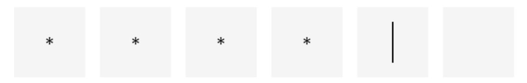

# InputBoxView
一个非常方便的输入框，验证码、密码、车牌输入等等都可使用，非常的方便！

## 效果展示





## 快速开始

1、在你的根项目下的build.gradle文件下，引入maven。

```groovy
allprojects {
    repositories {
        maven { url "https://gitee.com/AbnerAndroid/almighty/raw/master" }
    }
}
```
2、在你需要使用的Module中build.gradle文件下，引入依赖。

```groovy
dependencies {
    implementation 'com.vip:edit:1.0.1'
}
```
3、XML引入即可

```xml
    <com.vip.edit.InputBoxView
           android:id="@+id/ib_view"
           android:layout_width="match_parent"
           android:layout_height="wrap_content"
           android:layout_marginLeft="10dp"
           android:layout_marginTop="30dp"
           android:layout_marginRight="10dp"
           app:input_background="#f5f5f5"
           app:input_canvas_type="rect"
           app:input_length="6"
           app:input_text_size="16sp"
           app:input_text_type="round"
           app:layout_constraintLeft_toLeftOf="parent"
           app:layout_constraintTop_toTopOf="parent" />

```

4、属性介绍

| 属性 | 类型 | 概述 |
|  ----  |  ----  |  ----  |
| input_canvas_type | enum | 绘制类型,目前有三种，线(line)，矩形(rect)，圆角(round),圆角需要结合属性input_radius使用 |
| input_canvas_style | enum | 绘制画笔类型，空心还是实心，空心(stroke)，实心(fill)，实心和空心(fill_and_stroke) |
| input_background | color | 输入框的背景 |
| input_select_background | color | 输入框的选择背景 |
| input_radius | dimension | 输入框圆角度数 |
| input_line_height | dimension | 输入框下划线的高度 |
| input_length | integer | 输入框的长度 |
| input_spacing | dimension | 输入框的间距 |
| input_text_color | color | 输入框的内容颜色 |
| input_text_size | dimension | 输入框的文字大小 |
| input_text_type | enum | 输入框的文字类型，普通文字(text)，星号(asterisk)，黑圆圈(round) |
| input_is_cursor | boolean | 输入框是否有光标,默认展示光标 |
| input_cursor_direction | boolean | 输入框光标方向 |
| input_cursor_width | dimension | 输入框光标宽度 |
| input_cursor_color | color | 输入框光标颜色 |
| input_cursor_spacing | color | 输入框光标间距 |
| input_cursor_is_twinkle | boolean | 输入框的光标是否闪烁 |
| input_is_android_keyboard | boolean | 输入框是否弹起原生的软件盘，默认谈起，可以调用自定义的键盘 |

5、方法介绍

| 方法 | 参数 | 概述 |
|  ----  |  ----  |  ----  |
| clearContent | 无参 | 清空内容 |
| setContent | String | 设置内容 |
| hideInputMethod | 无参 | 隐藏软键盘，使用系统软键盘时 |
| showKeyBoard | 回调函数 | 需要弹起自己的软键盘时可以调用 |
| inputChangeContent | 回调函数 | 获取连续的输入结果 |
| inputEndResult | 回调函数 | 获取最终的输入内容，当等于你设置的length时进行回调 |


## 文章介绍


## 欢迎关注作者

微信搜索【Android干货铺】，或扫描下面二维码关注，查阅更多技术文章！


## License

```
Copyright (C) AbnerMing, InputBoxView Open Source Project

Licensed under the Apache License, Version 2.0 (the "License");
you may not use this file except in compliance with the License.
You may obtain a copy of the License at

     http://www.apache.org/licenses/LICENSE-2.0

Unless required by applicable law or agreed to in writing, software
distributed under the License is distributed on an "AS IS" BASIS,
WITHOUT WARRANTIES OR CONDITIONS OF ANY KIND, either express or implied.
See the License for the specific language governing permissions and
limitations under the License.
```
